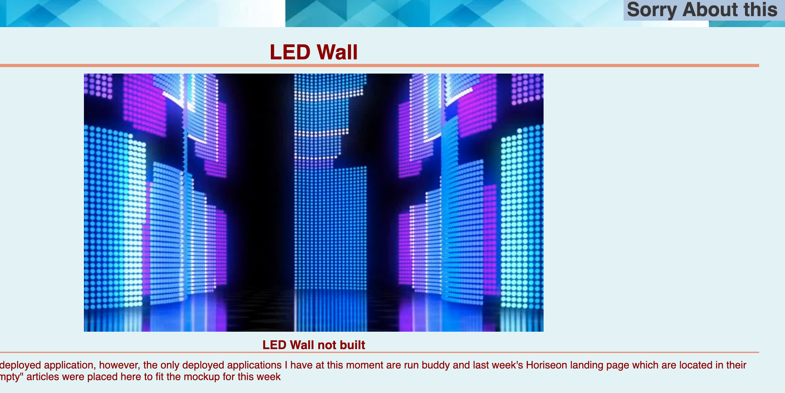
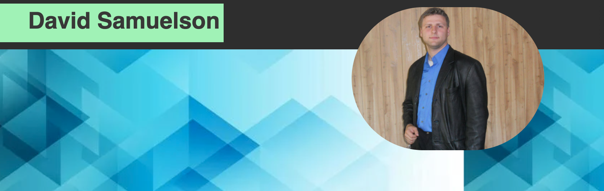
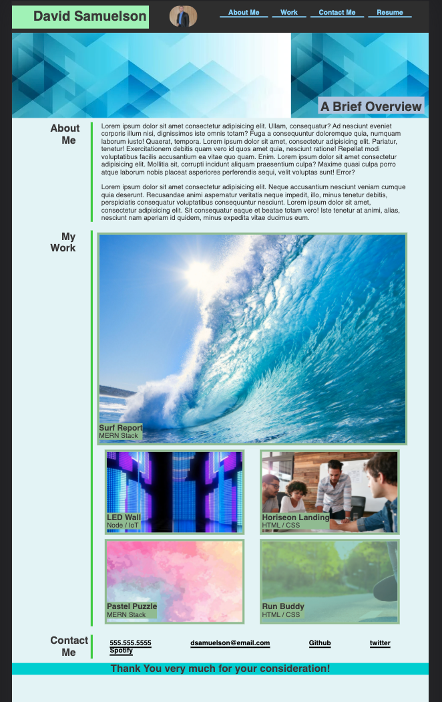

# sample-portfolio
a portfolio with a sampling of work

## page site
https://dsamuelson.github.io/sample-portfolio

## some of the work is not finished
You will be directed to a page that explains the work is not finished but are placeholders for the mock-up so that the mock-up would match.

## image of me will expand when hovered over

## Contact me section information

I do not have a linked twitter or spotify account and email and phone are fake (used just to satisfy the mock-up)

## mobile responsiveness

This site will change size depending on the browser it's in

